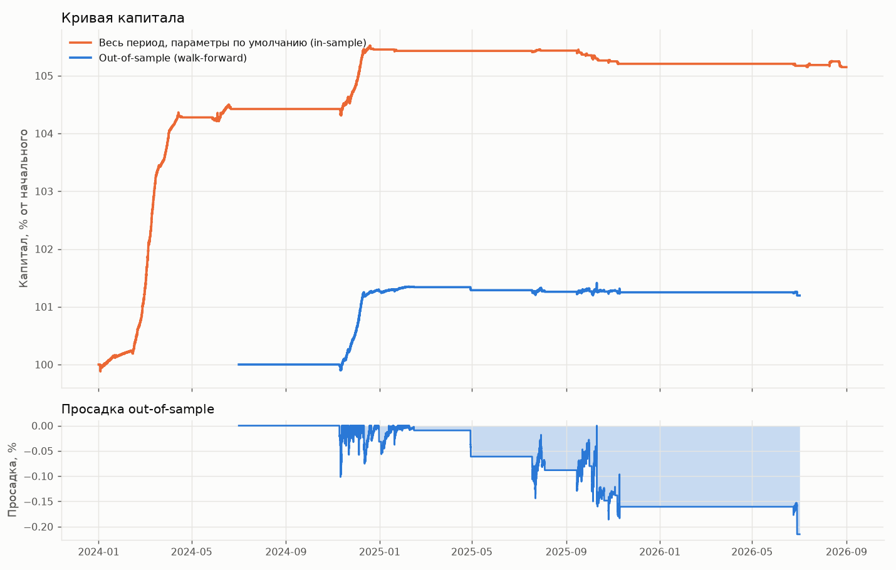

# Отчёт бэктеста: фандинг-арбитраж

Сформирован 2026-09-27 10:37 UTC. Биржа: `binance_vision`. Стартовый капитал: 10 000 $.

## Коротко

Результат по out-of-sample отрезкам walk-forward: положительный, 0.6% в годовых при просадке 0.2% и 27 сделках. Издержки съели 46.0% валового дохода.

## Out-of-sample (главные цифры)

Сетка из 18 комбинаций, 8 отрезков. Параметры подбирались только на обучающем отрезке и проверялись на следующем за ним.

| Показатель | Значение |
|---|---|
| Период | 2024-07-01 → 2026-07-02 (730 дней) |
| Капитал в начале и в конце | 10 000 $ → 10 119 $ |
| Доходность за период | 1.2% |
| Доходность в годовых | 0.6% |
| Sharpe (по дневным данным) | 2.37 |
| Максимальная просадка | 0.2% |
| Сделок (полных кругов) | 27, частичных сокращений 6 |
| Доля прибыльных сделок | 59.3% |
| Средняя длительность позиции | 15.9 дней |
| Время в рынке | 21.8% |
| Оборот в год (к капиталу) | 2.6x |
| Получено фандинга | 193 $ |
| Результат по базису (спот минус перп, по средним ценам) | 28 $ |
| Комиссии биржи | 68 $ |
| Спред и проскальзывание | 34 $ |
| Доля всех издержек в валовом доходе | 46.0% |
| Стоп-краны, пополнения маржи, сокращения | 0, 49, 6 |
| Отклонённых входов (не хватило денег или размера) | 0 |

| Отрезок | Обучение | Проверка | Выбранные параметры | Sharpe обуч. | Доход обуч. | Доход провер. | Просадка провер. | Сделок провер. |
|---|---|---|---|---|---|---|---|---|
| 1 | 2024-01-01 → 2024-07-01 | 2024-07-01 → 2024-09-30 | entry_threshold_apr=0.12, exit_threshold_apr=0.02, hold_horizon_periods=180 | 11.46 | 5.3% | 0.0% | -0.0% | 0 |
| 2 | 2024-04-01 → 2024-09-30 | 2024-09-30 → 2024-12-31 | entry_threshold_apr=0.12, exit_threshold_apr=0.04, hold_horizon_periods=180 | 3.06 | 0.5% | 1.3% | 0.1% | 7 |
| 3 | 2024-07-01 → 2024-12-31 | 2024-12-31 → 2025-04-01 | entry_threshold_apr=0.12, exit_threshold_apr=0.02, hold_horizon_periods=180 | 6.14 | 1.3% | 0.1% | 0.0% | 2 |
| 4 | 2024-09-30 → 2025-04-01 | 2025-04-01 → 2025-07-01 | entry_threshold_apr=0.12, exit_threshold_apr=0.02, hold_horizon_periods=180 | 7.33 | 1.6% | -0.1% | 0.1% | 1 |
| 5 | 2024-12-31 → 2025-07-01 | 2025-07-01 → 2025-10-01 | entry_threshold_apr=0.12, exit_threshold_apr=0.02, hold_horizon_periods=180 | 0.45 | 0.0% | -0.0% | 0.1% | 9 |
| 6 | 2025-04-01 → 2025-10-01 | 2025-10-01 → 2025-12-31 | entry_threshold_apr=0.12, exit_threshold_apr=0.02, hold_horizon_periods=180 | -0.90 | -0.1% | -0.0% | 0.2% | 7 |
| 7 | 2025-07-01 → 2025-12-31 | 2025-12-31 → 2026-04-01 | entry_threshold_apr=0.12, exit_threshold_apr=0.02, hold_horizon_periods=180 | -0.07 | -0.0% | 0.0% | -0.0% | 0 |
| 8 | 2025-10-01 → 2026-04-01 | 2026-04-01 → 2026-07-02 | entry_threshold_apr=0.12, exit_threshold_apr=0.02, hold_horizon_periods=180 | -0.24 | -0.0% | -0.1% | 0.1% | 1 |

## Весь период с параметрами по умолчанию (для справки, in-sample)

| Показатель | Значение |
|---|---|
| Период | 2024-01-01 → 2026-08-31 (974 дней) |
| Капитал в начале и в конце | 10 000 $ → 10 515 $ |
| Доходность за период | 5.1% |
| Доходность в годовых | 1.9% |
| Sharpe (по дневным данным) | 4.11 |
| Максимальная просадка | 0.4% |
| Сделок (полных кругов) | 46, частичных сокращений 14 |
| Доля прибыльных сделок | 58.7% |
| Средняя длительность позиции | 19.7 дней |
| Время в рынке | 22.0% |
| Оборот в год (к капиталу) | 3.1x |
| Получено фандинга | 636 $ |
| Результат по базису (спот минус перп, по средним ценам) | 54 $ |
| Комиссии биржи | 119 $ |
| Спред и проскальзывание | 57 $ |
| Доля всех издержек в валовом доходе | 25.4% |
| Стоп-краны, пополнения маржи, сокращения | 0, 88, 14 |
| Отклонённых входов (не хватило денег или размера) | 0 |

### По монетам (весь период, параметры по умолчанию)

| Монета | Сделок | Фандинг | Издержки | Итог |
|---|---|---|---|---|
| WLD | 3 | 132 $ | 8 $ | 123 $ |
| FIL | 1 | 91 $ | 3 $ | 89 $ |
| INJ | 3 | 93 $ | 8 $ | 86 $ |
| ACE | 2 | 70 $ | 5 $ | 63 $ |
| AVAX | 2 | 65 $ | 4 $ | 62 $ |
| LINK | 1 | 31 $ | 4 $ | 27 $ |
| FET | 3 | 26 $ | 5 $ | 19 $ |
| PYTH | 2 | 19 $ | 5 $ | 18 $ |
| SUI | 1 | 22 $ | 3 $ | 18 $ |
| ETH | 2 | 23 $ | 6 $ | 17 $ |
| ADA | 1 | 19 $ | 3 $ | 16 $ |
| TAO | 1 | 8 $ | 3 $ | 5 $ |
| остальные 13 | | | | -29 $ |

## Среда фандинга: сколько вообще платили в этот период

По всем монетам и выплатам: фандинг выше 15% годовых был в 4.4% выплат, выше 50% в 1.6%, отрицательный в 26.5%. Стратегия зарабатывает только на выплатах выше порога входа после издержек, остальное время она ждёт в деньгах.

| Монета | Выплат | Средний фандинг, годовых | Медиана | Доля выше 15% | Доля отрицательных |
|---|---|---|---|---|---|
| GIGGLE | 1959 | 16.1% | 10.9% | 4.6% | 8.5% |
| ASTER | 2078 | 10.5% | 10.9% | 4.3% | 18.1% |
| PUMP | 2912 | 10.0% | 10.9% | 6.8% | 16.7% |
| UNI | 2922 | 8.4% | 10.5% | 6.8% | 14.5% |
| LTC | 2922 | 8.1% | 8.4% | 7.2% | 17.6% |
| LINK | 2922 | 8.1% | 10.2% | 6.7% | 16.9% |
| DOGE | 2922 | 7.5% | 7.6% | 7.6% | 21.9% |
| ETH | 2922 | 7.1% | 6.3% | 6.9% | 15.8% |
| BTC | 2922 | 7.1% | 6.2% | 5.9% | 15.1% |
| XPL | 2246 | 7.1% | 10.9% | 0.9% | 14.4% |
| ADA | 2922 | 7.0% | 10.3% | 7.2% | 22.7% |
| NEAR | 2922 | 6.9% | 10.9% | 6.5% | 22.8% |
| FIL | 2922 | 6.7% | 10.9% | 8.2% | 22.1% |
| AAVE | 2922 | 6.6% | 7.5% | 5.3% | 20.7% |
| XRP | 2922 | 6.5% | 7.2% | 7.1% | 26.4% |
| ... ещё 45 монет | | | | | |

## Покрытие данных

- Источник: биржа `binance_vision`, таймфрейм `1h`, последняя докачка `2026-09-27T10:36:39.968172+00:00`.
- Правило отбора монет: top by min(spot, perp) 24h volume at selection time.
- Монет в данных: 60, пригодных: 60.
- Диапазон: 2024-01-01 → 2026-08-31.
- **Предупреждения (2):**
  - DEXE: интервал фандинга по данным 4 ч, в справочнике 1 ч; беру из данных
  - ONG: интервал фандинга по данным 4 ч, в справочнике 1 ч; беру из данных

## Допущения и оговорки

- **Источник данных: Данные из публичного архива Binance как замена Bybit. Ставки фандинга на Bybit отличаются.**
- Комиссии: спот maker 10.0 bps, taker 10.0 bps; перп maker 2.0 bps, taker 5.5 bps. Проверьте свой тариф на бирже, по умолчанию стоят публичные ставки без VIP.
- Спред: истории стакана нет, взят 5.0 bps на каждой ноге.
- Проскальзывание: 100.0 bps на каждые 100% минутного объёма.
- Маржа шорт-ноги изолированная, поддерживающая ставка 1.00%. Это строже unified-аккаунта.
- Predicted funding биржи в бэктесте недоступен, прогноз только по истории. В живой торговле он будет ограничивать прогноз сверху.
- Вселенная монет выбрана по объёму на момент скачивания: есть ошибка выжившего, результат может быть завышен.
- Позиции в конце периода закрываются принудительно, чтобы учесть все издержки.

## Параметры стратегии

```yaml
entry_threshold_apr: 0.12
exit_threshold_apr: 0.04
rotation_margin_apr: 0.05
confirm_periods: 3
funding_ewma_span: 6
hold_horizon_periods: 90
min_24h_volume_usd: 20000000.0
max_spread_bps: 5.0
max_order_pct_of_1min_volume: 5.0
max_hedge_slippage_bps: 10.0
leg_timeout_sec: 2.0
unhedged_max_sec: 10.0
max_asset_pct: 10.0
max_positions: 8
min_notional_usd: 100.0
max_leverage_perp: 2.0
min_liq_distance_pct: 40.0
cash_reserve_pct: 15.0
stale_data_sec: 5.0
daily_dd_hard_stop_pct: 3.0
reconcile_interval_sec: 60
api_error_rate_breaker: {'max_errors': 5, 'window_sec': 60}
stablecoin_depeg_pct: 1.0
event_close_before_hours: 24.0
rebalance_interval_hours: 8
blacklist: ['USDC', 'FDUSD', 'USD1', 'TUSD', 'DAI', 'USDE', 'BUSD']
```


