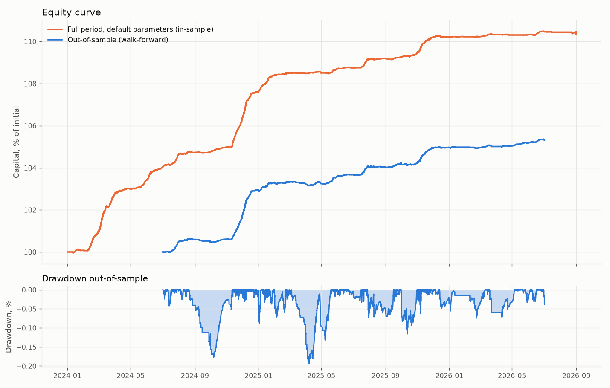

# Backtest report: funding-rate arbitrage

Generated 2026-09-27 17:24 UTC. Exchange: `binance_vision + hyperliquid`. Mode: cross-venue perp-perp (long one venue, short the other). Initial capital: 10 000 $.

## Summary

Result on the out-of-sample walk-forward folds: positive, 2.6% annualised with a max drawdown of 0.2% over 145 trades. Costs took 37.3% of gross income.

## Out-of-sample (the numbers that matter)

Grid of 108 combinations, 8 folds. Parameters were tuned on the training window only and evaluated on the window that follows it.

| Metric | Value |
|---|---|
| Period | 2024-07-01 to 2026-07-02 (730 days) |
| Capital, start to end | 10 000 $ to 10 532 $ |
| Return over the period | 5.3% |
| Annualised return | 2.6% |
| Sharpe (daily returns) | 6.91 |
| Max drawdown | 0.2% |
| Trades (full round trips) | 145, partial reductions 15 |
| Winning trades | 51.7% |
| Average holding time | 16.2 days |
| Time in market | 87.3% |
| Annual turnover (x capital) | 11.2x |
| Funding received | 833 $ |
| Basis P&L (spot minus perp, at mid prices) | 0 $ |
| Exchange fees | 149 $ |
| Spread and slippage | 162 $ |
| All costs as a share of gross income | 37.3% |
| Hard stops, margin top-ups, reductions | 0, 319, 15 |
| Rejected entries (not enough cash or size) | 0 |

| Fold | Training | Test | Chosen parameters | Train Sharpe | Train return | Test return | Test drawdown | Test trades |
|---|---|---|---|---|---|---|---|---|
| 1 | 2024-01-01 to 2024-07-01 | 2024-07-01 to 2024-09-30 | entry_threshold_apr=0.2, exit_threshold_apr=0.02, hold_horizon_periods=90, funding_ewma_span=24, confirm_periods=3 | 13.46 | 4.1% | 0.5% | 0.2% | 12 |
| 2 | 2024-04-01 to 2024-09-30 | 2024-09-30 to 2024-12-31 | entry_threshold_apr=0.2, exit_threshold_apr=0.02, hold_horizon_periods=90, funding_ewma_span=24, confirm_periods=6 | 9.95 | 1.4% | 2.4% | 0.1% | 13 |
| 3 | 2024-07-01 to 2024-12-31 | 2024-12-31 to 2025-04-01 | entry_threshold_apr=0.08, exit_threshold_apr=0.02, hold_horizon_periods=90, funding_ewma_span=24, confirm_periods=3 | 11.63 | 3.7% | 0.3% | 0.1% | 35 |
| 4 | 2024-09-30 to 2025-04-01 | 2025-04-01 to 2025-07-01 | entry_threshold_apr=0.08, exit_threshold_apr=0.02, hold_horizon_periods=90, funding_ewma_span=24, confirm_periods=6 | 12.10 | 3.6% | 0.4% | 0.1% | 19 |
| 5 | 2024-12-31 to 2025-07-01 | 2025-07-01 to 2025-10-01 | entry_threshold_apr=0.08, exit_threshold_apr=0.02, hold_horizon_periods=90, funding_ewma_span=24, confirm_periods=6 | 7.44 | 1.0% | 0.5% | 0.1% | 31 |
| 6 | 2025-04-01 to 2025-10-01 | 2025-10-01 to 2025-12-31 | entry_threshold_apr=0.08, exit_threshold_apr=0.02, hold_horizon_periods=90, funding_ewma_span=24, confirm_periods=6 | 6.06 | 0.9% | 0.8% | 0.1% | 20 |
| 7 | 2025-07-01 to 2025-12-31 | 2025-12-31 to 2026-04-01 | entry_threshold_apr=0.12, exit_threshold_apr=0.02, hold_horizon_periods=90, funding_ewma_span=12, confirm_periods=6 | 8.86 | 1.8% | 0.1% | 0.1% | 7 |
| 8 | 2025-10-01 to 2026-04-01 | 2026-04-01 to 2026-07-02 | entry_threshold_apr=0.12, exit_threshold_apr=0.02, hold_horizon_periods=90, funding_ewma_span=24, confirm_periods=3 | 7.13 | 1.0% | 0.3% | 0.0% | 8 |

## Full period with default parameters (reference, in-sample)

| Metric | Value |
|---|---|
| Period | 2024-01-01 to 2026-08-31 (974 days) |
| Capital, start to end | 10 000 $ to 11 034 $ |
| Return over the period | 10.3% |
| Annualised return | 3.8% |
| Sharpe (daily returns) | 8.51 |
| Max drawdown | 0.1% |
| Trades (full round trips) | 179, partial reductions 3 |
| Winning trades | 54.7% |
| Average holding time | 18.1 days |
| Time in market | 82.5% |
| Annual turnover (x capital) | 10.2x |
| Funding received | 1 425 $ |
| Basis P&L (spot minus perp, at mid prices) | 0 $ |
| Exchange fees | 188 $ |
| Spread and slippage | 203 $ |
| All costs as a share of gross income | 27.4% |
| Hard stops, margin top-ups, reductions | 0, 351, 3 |
| Rejected entries (not enough cash or size) | 0 |

### By coin (full period, default parameters)

| Coin | Trades | Funding | Costs | Net |
|---|---|---|---|---|
| DOGE:binance_vision>hyperliquid | 4 | 202 $ | 3 $ | 194 $ |
| NEAR:binance_vision>hyperliquid | 8 | 183 $ | 11 $ | 162 $ |
| TAO:binance_vision>hyperliquid | 13 | 187 $ | 17 $ | 149 $ |
| ZEC:binance_vision>hyperliquid | 4 | 105 $ | 6 $ | 94 $ |
| ENA:binance_vision>hyperliquid | 14 | 101 $ | 18 $ | 65 $ |
| SOL:binance_vision>hyperliquid | 12 | 88 $ | 16 $ | 60 $ |
| UNI:binance_vision>hyperliquid | 8 | 81 $ | 10 $ | 58 $ |
| ONDO:hyperliquid>binance_vision | 5 | 57 $ | 6 $ | 43 $ |
| AAVE:binance_vision>hyperliquid | 8 | 51 $ | 5 $ | 38 $ |
| ONDO:binance_vision>hyperliquid | 11 | 61 $ | 12 $ | 33 $ |
| PENGU:binance_vision>hyperliquid | 4 | 31 $ | 2 $ | 28 $ |
| WLD:hyperliquid>binance_vision | 2 | 30 $ | 2 $ | 26 $ |
| other 24 | | | | 84 $ |

## Funding environment: what the market actually paid

Across all coins and settlements: funding above 15% annualised in 12.4% of settlements, above 50% in 2.4%, negative in 50.0%. The strategy only earns on settlements above the entry threshold after costs; the rest of the time it waits in cash.

| Coin | Settlements | Mean funding, annualised | Median | Share above 15% | Share negative |
|---|---|---|---|---|---|
| GRAM:binance_vision>hyperliquid | 182 | 16.3% | 5.7% | 37.4% | 14.8% |
| ZEC:binance_vision>hyperliquid | 758 | 16.2% | 6.5% | 31.0% | 24.1% |
| TAO:binance_vision>hyperliquid | 2618 | 12.7% | 5.8% | 28.8% | 16.8% |
| AAVE:binance_vision>hyperliquid | 2368 | 11.0% | 5.9% | 24.2% | 15.4% |
| DOGE:binance_vision>hyperliquid | 2368 | 10.3% | 3.8% | 20.3% | 28.0% |
| NEAR:binance_vision>hyperliquid | 2368 | 10.1% | 3.9% | 25.8% | 23.5% |
| ENA:binance_vision>hyperliquid | 2645 | 8.2% | 4.1% | 25.8% | 35.0% |
| INJ:binance_vision>hyperliquid | 2368 | 8.0% | 1.2% | 21.2% | 31.9% |
| LINK:binance_vision>hyperliquid | 2368 | 7.7% | 3.0% | 17.8% | 23.0% |
| SOL:binance_vision>hyperliquid | 2368 | 7.2% | 4.5% | 20.1% | 30.4% |
| BNB:binance_vision>hyperliquid | 2368 | 6.8% | 7.7% | 13.6% | 28.4% |
| XPL:binance_vision>hyperliquid | 1124 | 6.3% | 2.1% | 10.3% | 26.8% |
| BTC:binance_vision>hyperliquid | 2368 | 6.0% | 3.8% | 13.8% | 25.3% |
| AVAX:binance_vision>hyperliquid | 2368 | 5.5% | 2.1% | 20.4% | 31.8% |
| PUMP:binance_vision>hyperliquid | 1254 | 5.4% | 4.2% | 13.6% | 25.4% |
| ... 33 more coins | | | | | |

## Data coverage

- Source: exchange `binance_vision + hyperliquid`, timeframe `1h`, last sync `2026-09-27T10:36:39.968172+00:00 / 2026-09-27T17:13:36.724908+00:00`.
- Coin selection rule: coins present on both venues.
- Coins in data: 24, usable: 24.
- Range: 2024-01-01 to 2026-08-31.
- No warnings.

## Assumptions and caveats

- **Data source: Binance archive (funding, prices) plus Hyperliquid info API (funding). Venue basis is not modelled; fees are each venue's public base tier.**
- Fees: spot maker 2.0 bps, taker 5.0 bps; perp maker 1.5 bps, taker 4.5 bps. Check your own tier on the exchange; defaults are public non-VIP rates.
- Spread: no order-book history, 5.0 bps assumed on each leg.
- Slippage: 100.0 bps per 100% of one minute's volume.
- Short-leg margin is isolated, maintenance rate 1.00%. Stricter than a unified account.
- The exchange's predicted funding is not available in the backtest; the forecast uses history only. Live trading caps the forecast with it.
- The coin universe was picked by volume at download time: survivorship bias, results may be flattered.
- Positions are force-closed at the end of the period so every cost is counted.

## Strategy parameters

```yaml
entry_threshold_apr: 0.12
exit_threshold_apr: 0.02
rotation_margin_apr: 0.05
confirm_periods: 6
funding_ewma_span: 24
hold_horizon_periods: 90
min_24h_volume_usd: 5000000.0
max_spread_bps: 5.0
max_order_pct_of_1min_volume: 5.0
max_hedge_slippage_bps: 10.0
leg_timeout_sec: 2.0
unhedged_max_sec: 10.0
max_asset_pct: 10.0
max_positions: 8
min_notional_usd: 100.0
max_leverage_perp: 2.0
min_liq_distance_pct: 40.0
cash_reserve_pct: 15.0
long_leg: perp
stale_data_sec: 5.0
daily_dd_hard_stop_pct: 3.0
reconcile_interval_sec: 60
api_error_rate_breaker: {'max_errors': 5, 'window_sec': 60}
stablecoin_depeg_pct: 1.0
event_close_before_hours: 24.0
rebalance_interval_hours: 8
blacklist: ['USDC', 'FDUSD', 'USD1', 'TUSD', 'DAI', 'USDE', 'BUSD']
```


